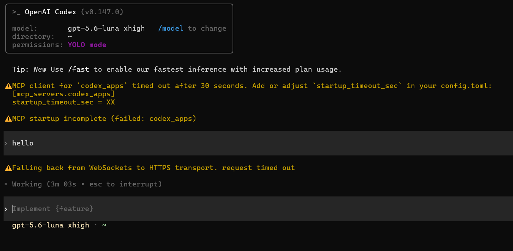
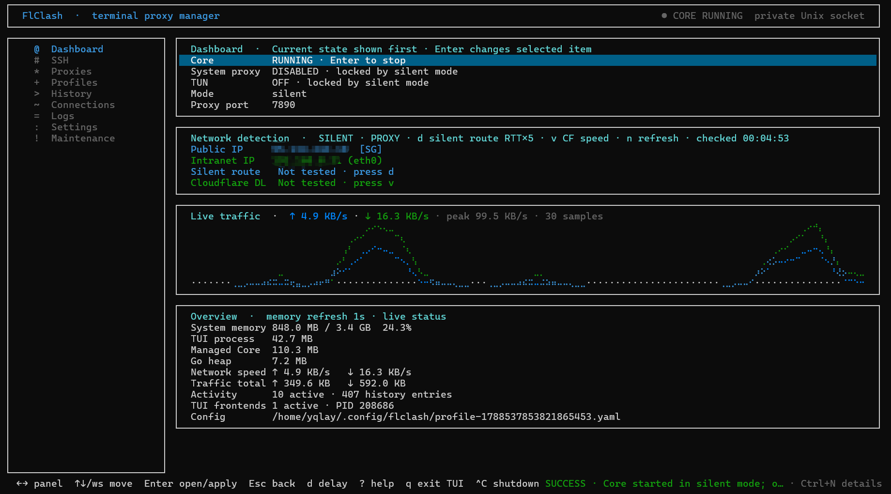
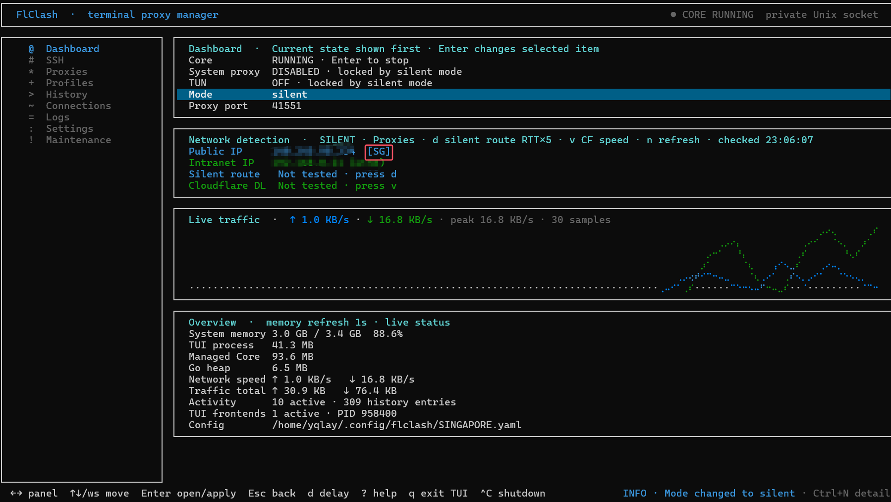
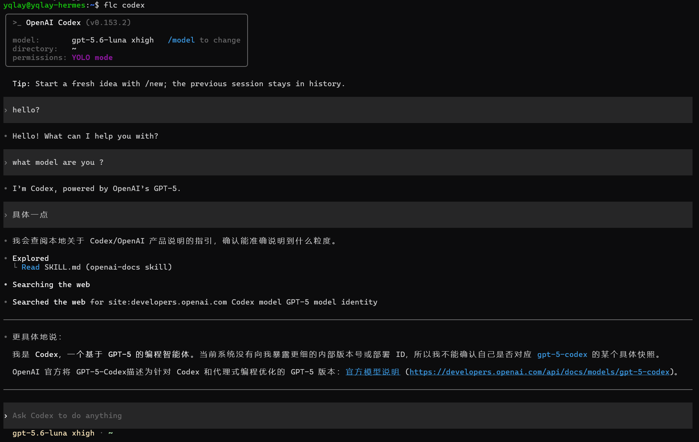
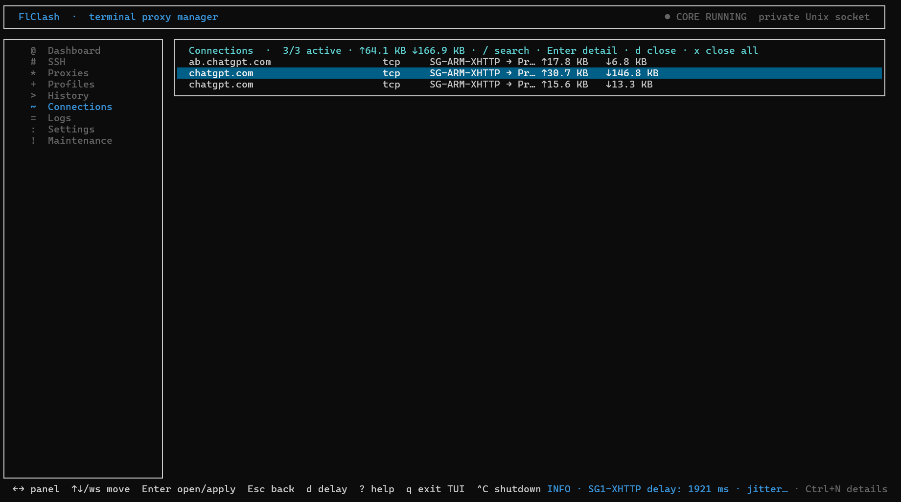

# FlClash TUI

[English](README_EN.md) · [完整文档](CLI_LINUX.md) · [下载版本](https://github.com/yqlay/flclash-tui/releases)

[](https://github.com/yqlay/flclash-tui/releases)
[](https://github.com/yqlay/flclash-tui/releases)
[](LICENSE)

Linux / SSH / 无头机上的 Mihomo 终端管理器。运行 `flclash` 打开全屏 TUI；默认 **silent**，只有 `flc COMMAND` 走代理。

## 国内环境 无头 Linux 用不了 Codex / Claude？一条 `flc` 就够了

在国内的网络环境里，我们基本上是无法直接安装 Codex，也很难直接使用 `codex` 的。

连接不上服务器 belike：

<p align="center">
  
</p>

手动敲代理命令扯东扯西很麻烦。FlClash TUI 给无头 Linux 的方案很直接：正常导入订阅、选择节点，然后用 `flc` 启动。

## 适合什么场景

- 远程 Linux、云服务器、实验室主机或 WSL 上已经有订阅；
- 只希望 Codex、Claude、Git、npm 等指定命令走代理；
- 不希望机器上的其他服务、容器、SSH 会话被全局代理影响；
- 希望代理入口未就绪时明确失败，而不是静默直连。

## 第一步：先解决“安装前还没有代理”的问题

执行下面命令可以安装 `flclash-tui`：

```bash
curl -fsSL https://raw.githubusercontent.com/yqlay/flclash-tui/main/install.sh | bash
```

强制便携安装：

```bash
curl -fsSL https://raw.githubusercontent.com/yqlay/flclash-tui/main/install.sh | bash -s -- --method portable
```

如果 GitHub 连接不稳定，从 [Releases](https://github.com/yqlay/flclash-tui/releases) 下载对应架构的 `.deb` 或 `.tar.gz`，scp 过去，再 `sudo dpkg -i` 安装。不要写死版本号，始终用最新 Release。

## 第二步：导入订阅并选择节点

命令行敲 `flclash` 回车打开 TUI。在 **Profiles** 导入订阅 URL 或本地文件，选中该 profile 按 Enter 激活，随后在 **Proxies** 选择代理组和节点（选中节点后可按 `d` 测延迟）。Dashboard 推荐 `silent` 模式（不会干扰其他程序），然后选中 **Core** 按 Enter 启动（其他模式还需要启动 **System proxy**）。

<p align="center">
  
</p>

<p align="center">
  
</p>

无头机器默认使用 `silent` 模式：系统代理和 TUN 都保持关闭，只有显式在命令前面加上 `flc` 的命令会走代理。

```bash
flc example_command
```

如果要加 sudo：

```bash
flc sudo -E example_command
```

这里的 `-E` 是让 sudo 继承环境变量，以便走代理。

silent 模式下 FlClash 使用认证后的私有 loopback listener；不需要把端口暴露给公网或局域网。若入口、Core 或节点不可用，`flc` 会报错并拒绝执行，不会把命令交给直连网络。

## 第三步：直接运行 Codex 或 Claude

```bash
flc codex
flc claude
```

`flc codex` 连上服务器之后是这样：

<p align="center">
  
</p>

可以在 Dashboard 上看流量图，也可以在 **Connections** 里看到走代理的具体连接：

<p align="center">
  
</p>

`flc COMMAND` 会仅为这条命令（以及 `flc bash` 里的子进程）设置大写和小写的 `HTTP_PROXY`、`HTTPS_PROXY`、`ALL_PROXY`。同样适用于常见开发工具：

```bash
flc git clone https://github.com/owner/repository.git
flc npm install
flc curl https://example.com
flc sh -c 'git fetch --all && npm ci'
```

如果要连续运行多个命令，不必重复输入 `flc`，可以开一个代理 shell：

```bash
flc bash

# 这个 shell 内的子命令继承代理环境
codex
claude
git push
```

退出该 shell 后环境变量立刻消失；当前用户的其他 shell、系统服务、Docker 容器和已有连接不会受影响。

## 用完后关闭

```bash
flclash exit    # 停止当前用户的前端、Backend、Core 和 SSH
```

或者 `flclash` 进入 TUI 后按 `Ctrl+C`，也可以结束程序。

不会残留 shell 代理环境。下次启动后，重新运行 `flclash`，再用 `flc codex` 或 `flc claude` 即可。

TUI 里按 `q` 或关掉那个终端，只退出当前界面，Backend 还在，`flc` 仍可用。

## 桌面 / 全局代理

要让浏览器等普通程序也走代理：在 Dashboard 把模式改成 `rule` 或 `global`，再启用 **System proxy** 或 TUN。无头机优先用上面的 `flc`。

## SSH 代理

只在**需要被代理的那台机器**上运行 FlClash，把另一台已能上网的机器当作 SSH host。之后 `flc ssh COMMAND` 会把这条命令从 host 的网络出口送出去。B 不开放代理端口，A 只需现有 SSH。

```bash
flclash ssh import                 # 从 ~/.ssh/config 导入 Host
flclash ssh add home host --user user --password --local-port 1080
flclash ssh default home
flc ssh curl https://example.com   # 自动连接默认配置；断线会重建隧道

# 默认交给 host 的网络策略；-d 只在 host 的 FlClash TUN 关闭时允许直连
flc ssh -d curl https://example.com

flclash ssh add school host --user user --jump bastion --identity ~/.ssh/id_ed25519 --passphrase --password
flclash ssh test                   # 打开隧道并做 SOCKS5 握手
flclash ssh disconnect home        # 只关 SSH；flclash backend stop 不停隧道
```

没有已打开的隧道时，`flc ssh` 会连接默认（或唯一）配置并保持为持久隧道。TUI 的 **SSH** 页同样能管理配置；`u` 将当前项标为默认。`flc ssh -d` 在远端透明 TUN 开启、状态未知或版本不兼容时会拒绝执行。WSL 不要直接用权限显示为 `0777` 的 `/mnt/c/...` 私钥，先复制到 `~/.ssh/` 并 `chmod 600`。

完整 SSH 字段、密钥口令、Jump 和 Dashboard 测速见 [CLI_LINUX.md](CLI_LINUX.md)。

## 常用命令

```bash
flclash status
flclash mode rule|global|direct|silent
flclash port [PORT|off]
flclash sys status|on|off
flclash tun status|user on|system on|off
flclash profile import URL
flclash profile import-file /path/to/nodes.txt
flclash logs --lines 100 --follow
flclash history show --limit 20
flclash ssh disconnect             # 只关 SSH 隧道
flclash backend stop               # 停代理 Backend+Core，SSH 还在
flclash exit                       # 完全退出前端、Backend、Core 和 SSH
```

TUI：`q` 只退当前界面；`Ctrl+C` 全停；Dashboard 管 Core、模式、flc、端口、TUN 和 System proxy；`?` 查看快捷键；`Ctrl+N` 查看通知。

订阅导入兼容 Mihomo/Clash YAML、节点 URI 列表及其 Base64、SIP008、sing-box/Xray JSON，以及常见 Surge/Quantumult X/Loon 节点行。不支持或损坏的节点会中止整次导入，不会静默漏掉。

完整命令、TUN、Profiles、History、日志、配置目录和故障排查见 [CLI_LINUX.md](CLI_LINUX.md)。程序内可使用 `flclash --help`、`flclash COMMAND --help` 和 `flc --help`。

本项目是 [FlClash](https://github.com/chen08209/FlClash) 的非官方终端衍生版本，许可证与版权信息见 [NOTICE](NOTICE) 和 [LICENSE](LICENSE)。
